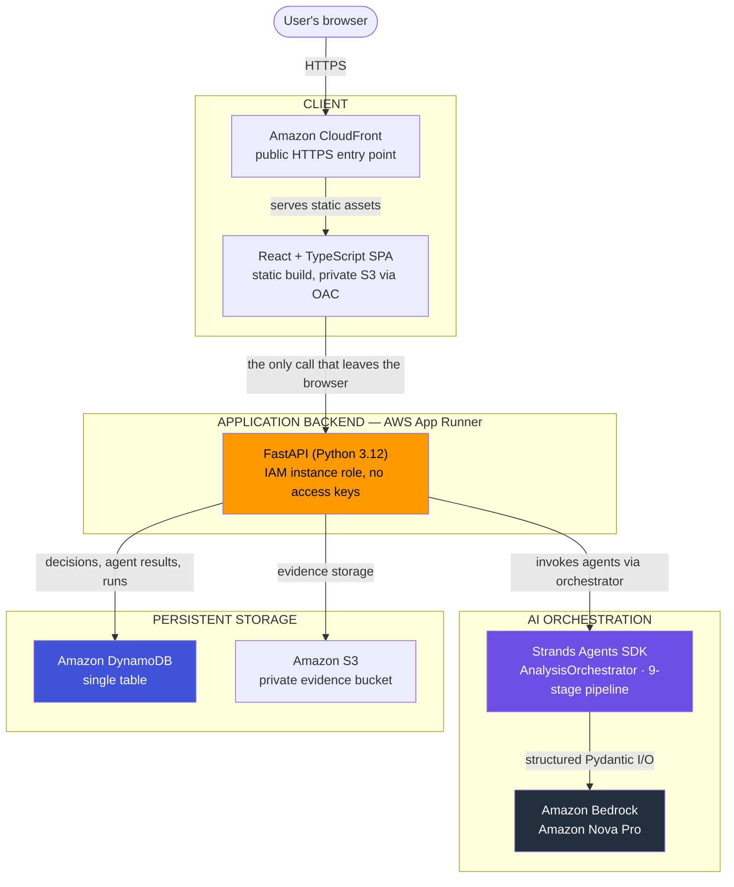

<div align="center">


# REGRET ENGINE

### **Know what could make your decision fail.**

*Decision-validation infrastructure — not a chatbot, not a recommendation engine*

[](https://aws.amazon.com/bedrock/)
[](https://aws.amazon.com/ai/generative-ai/nova/)
[](https://strandsagents.com/)
[](https://fastapi.tiangolo.com/)
[](https://react.dev/)
[](LICENSE)

[Live App](https://d20l6vg17brb6a.cloudfront.net/) • [Features](#-what-it-does) • [Architecture](#-architecture) • [Pipeline](#-the-nine-agent-pipeline) • [Quick Start](#-quick-start) • [AWS](#-aws-services) • [Team](#-meet-the-team)

---

</div>

## 🎯 Overview

**REGRET ENGINE** takes a real decision — described in your own words, with real constraints and real evidence — and runs it through **nine specialized AI agents** on Amazon Bedrock. The output isn't advice. It's the one thing a generic AI assistant never gives you:

> **The specific, falsifiable condition under which this decision would turn out to be a mistake — plus the cheapest experiment to test whether that condition is true, before you commit.**

When you run that experiment and report what actually happened, REGRET ENGINE re-evaluates your decision **deterministically** — no second guess from a language model.

<div align="center">

### 🧩 **Nine-agent pipeline** • 🎯 **Breaking thresholds** • 🧪 **Real-world experiments** • ⚖️ **Deterministic re-evaluation**

```
Decision  →  Failure Conditions  →  Threshold  →  Experiment  →  Real Evidence  →  Re-evaluation
```

</div>

---

## 🌐 Live Deployment

<div align="center">

| | |
|---|---|
| 🖥️ **Frontend** (CloudFront + private S3) | [d20l6vg17brb6a.cloudfront.net](https://d20l6vg17brb6a.cloudfront.net/) |
| ⚙️ **Backend API** (AWS App Runner) | [usahfepdsw.ap-south-1.awsapprunner.com](https://usahfepdsw.ap-south-1.awsapprunner.com) |
| 📜 **API Docs** (Swagger UI) | [`/docs`](https://usahfepdsw.ap-south-1.awsapprunner.com/docs) |
| 💻 **Source** | [github.com/Cyberexe1/Regret_AI](https://github.com/Cyberexe1/Regret_AI) |

</div>

---

## ✨ What It Does

<table>
<tr>
<td width="50%">

### 🧠 **Assumption & Blindspot Discovery**
Surfaces what a decision quietly depends on
- Hidden assumptions with failure consequences
- Blindspots — the questions nobody asked
- Structured, not free-form prose

</td>
<td width="50%">

### 📑 **Evidence Grounding**
Weighs your evidence against each claim
- Supports / contradicts / **insufficient**
- Never treats silence as support
- User evidence and external research kept separate

</td>
</tr>
<tr>
<td width="50%">

### 🎯 **Breaking Thresholds**
The product's central artifact
- The exact variable + tipping-point value
- Numeric *or* qualitative when evidence is thin
- Never fabricates a number to look concrete

</td>
<td width="50%">

### 🧪 **Cheapest Credible Experiment**
Turns "risky" into "here's what to test"
- Hypothesis, steps, success/failure criteria
- A concrete decision rule
- Tied directly to a real threshold

</td>
</tr>
<tr>
<td width="50%">

### ⚖️ **Deterministic Re-evaluation**
Reality decides, not the model
- Observed result compared in plain code
- `strengthened` / `weakened` / `unchanged` / `inconclusive` / `requires_more_evidence`
- No model re-guess once evidence exists

</td>
<td width="50%">

### 🗂️ **Decision Intelligence Layers**
Everything downstream is deterministic
- Decision Memory & Evolution timeline
- Value-of-Information ranking
- Adaptive experiment loop + cross-decision patterns

</td>
</tr>
</table>

---

## 🏗️ Architecture

The browser only ever talks to **one** thing: the backend's own HTTPS API. It never touches Bedrock, DynamoDB, or S3 directly. The backend is the single component with an AWS identity.



<details>
<summary><b>📁 Project Structure</b></summary>

```
Regret_AI/
├── ⚙️ backend/                  FastAPI application
│   └── app/
│       ├── agents/             9-stage Strands pipeline + orchestrator
│       ├── api/routes/         HTTP route handlers
│       ├── core/               Config, logging, error handling
│       ├── repositories/       DynamoDB access layer
│       ├── research/           Optional external-research provider
│       ├── schemas/            Pydantic request/response/entity models
│       ├── services/           Business logic (evidence, re-evaluation, VOI)
│       ├── memory/             Decision Memory + historical context
│       ├── adaptive/           Adaptive experiment loop
│       ├── evolution/          Decision-evolution timeline (view, not stored)
│       ├── learning/           Cross-decision pattern detection
│       └── quality/            Deterministic analysis-quality engine
├── 🎨 frontend/                React 19 + TypeScript SPA (Vite)
│   └── src/                    api · components · hooks · pages · types
├── ☁️ infra/                   AWS CLI-driven infra config (IAM, App Runner, CloudFront)
├── 📚 docs/                    Architecture + agent-workflow diagrams, demo script
├── LICENSE
├── SUBMISSION.md               Hackathon submission write-up
└── README.md                   This file
```

</details>

---

## 🧩 The Nine-Agent Pipeline

Each stage is a real `strands.Agent` with a Pydantic `structured_output_model`. Each one consumes **only** the already-persisted, id-bearing structured output of the stages before it — never the user's raw text again, and never another agent's free-form prose. The order is a fixed dependency chain in `backend/app/agents/orchestrator.py`.

| # | Agent | Produces |
|---|-------|----------|
| 1 | **Decision Analyzer** | Decision type, goal, constraints, success criteria, key variables, facts/assumptions/unknowns |
| 2 | **Assumption Hunter** | Assumptions with importance, confidence, failure consequence |
| 3 | **Blindspot Hunter** | Blindspots — important unasked questions |
| 4 | **Research Agent** *(optional)* | External evidence from a real web search — never blocks the run |
| 5 | **Evidence Agent** | Findings: does evidence support, contradict, or fail to address each claim |
| 6 | **Devil's Advocate** | Evidence-grounded counter-arguments with severity |
| 7 | **Regret Simulator** | Concrete failure scenarios and triggers |
| 8 | 🎯 **Threshold Engine** | The exact variable + tipping-point value that would make the decision fail |
| 9 | 🧪 **Experiment Planner** | The cheapest experiment: hypothesis, steps, criteria, decision rule |

> The **Threshold Engine** and **Experiment Planner** sit deliberately near the end. Everything before them builds the evidence base; these two convert it into one falsifiable claim and one concrete way to test it.

<div align="center">

📖 Full reasoning pipeline: [`docs/agent-workflow.md`](docs/agent-workflow.md) • Infrastructure: [`docs/architecture.md`](docs/architecture.md)

</div>

---

## ⚖️ The Part That Isn't AI

This is the heart of the design. When you submit a real experiment result, the system does **not** ask a model to re-judge it. `app/services/re_evaluation_service.py` compares the observed value against the threshold's real bounds in plain code:

```
POST /experiments/{id}/results
        │
        ▼
persist result  ──►  deterministic threshold comparison  ──►  decision_assessment
                                                               (strengthened / weakened /
                                                                unchanged / inconclusive /
                                                                requires_more_evidence)
```

A second submission is rejected with `409 Conflict` — enforced by a DynamoDB **conditional write**, not just an application check. Once real evidence exists, the system doesn't get to change its mind for no reason.

> **AI proposes what to test. Reality provides the evidence. Deterministic logic evaluates what happened.**

Every intelligence layer built on top — Decision Memory, Value-of-Information, the Adaptive Experiment Loop, the Evolution timeline, cross-decision patterns, and the quality engine — follows the same rule: they read already-persisted records and derive results in deterministic Python, with **no additional model call**. Each is additive: if it fails, it's logged and the primary request still succeeds.

---

## 🆚 Why It's Different

<table>
<tr>
<td width="50%">

#### ❌ Traditional AI assistant
```
Question
   ↓
AI reasoning
   ↓
Confident opinion
```
*Ends where the real risk begins.*

</td>
<td width="50%">

#### ✅ REGRET ENGINE
```
Decision → Assumptions → Evidence
   → Failure Conditions → Threshold
   → Experiment → Reality
   → Deterministic Re-evaluation
```
*A falsifiable, evidence-driven loop.*

</td>
</tr>
</table>

- Never outputs "you should do this." It outputs a **breaking condition** and a way to test it.
- Every claim traces to your stated decision, your uploaded evidence, or an explicit assumption/unknown — never presented as fact when it isn't.
- Fabrication guard: any agent reference to an id it was never given is **dropped before storage**, never persisted as a dangling link.
- Re-evaluation is deterministic code, not another model call.

---

## ☁️ AWS Services

| Service | Role in the system |
|---------|--------------------|
| **Amazon Bedrock** | Runs every agent stage. Model: **Amazon Nova Pro** via the cross-region inference profile `apac.amazon.nova-pro-v1:0`. |
| **AWS App Runner** | Hosts the containerized FastAPI backend. Pulls from private ECR, assumes a dedicated IAM instance role — no AWS access keys in its environment. |
| **Amazon DynamoDB** | Single-table store for decisions and every agent's structured output, results, re-evaluations, and run status. |
| **Amazon S3** | A private evidence bucket + a *separate* private bucket for the React build. Both have Block Public Access fully enabled. |
| **Amazon CloudFront** | Public HTTPS entry point for the frontend, backed by S3 via Origin Access Control — direct S3 access returns `403`. |
| **Amazon ECR** | Private, image-scanned, immutable-tag registry for the backend container. |
| **AWS IAM** | Two least-privilege roles — no wildcards, no `AdministratorAccess`. |

---

## 🚀 Quick Start

<div align="center">

### Prerequisites

[](https://www.python.org/)
[](https://nodejs.org/)
[](https://aws.amazon.com/)

</div>

**Backend** (Windows PowerShell):

```powershell
cd backend
python -m venv .venv
.venv\Scripts\Activate.ps1
pip install -r requirements.txt
Copy-Item .env.example .env
python scripts/create_table.py    # one-time: creates the DynamoDB table
uvicorn app.main:app --reload --port 8000
```

**Frontend:**

```powershell
cd frontend
npm install
npm run dev        # http://localhost:5173
```

> 💡 No AWS account? The backend can point at a local DynamoDB-compatible endpoint. **AWS credentials are never set as environment variables** — boto3's standard provider chain (an AWS CLI profile locally, an IAM role in production) is the only supported path. See [`backend/README.md`](backend/README.md) for full setup.

**Run the tests** — no real AWS, credentials, or network required:

```powershell
cd backend
pytest             # moto-mocked DynamoDB; every Bedrock call site is patched
ruff check .

cd frontend
npm run test
npm run typecheck
npm run build
```

---

## 🛠️ Technology Stack

<div align="center">

| Layer | Technologies |
|-------|--------------|
| **Frontend** | React 19 · TypeScript · Vite · Tailwind CSS · Recharts · @xyflow/react · framer-motion |
| **Backend** | FastAPI · Python 3.12 · Pydantic v2 · boto3 |
| **AI / Agents** | Amazon Bedrock · Amazon Nova Pro · Strands Agents SDK · Pydantic structured outputs |
| **AWS Infra** | App Runner · DynamoDB · S3 · CloudFront · ECR · IAM |

</div>

---

## 📚 Documentation

<div align="center">

| Document | Description |
|----------|-------------|
| 🏗️ [`docs/architecture.md`](docs/architecture.md) | Deployed infrastructure architecture |
| 🧩 [`docs/agent-workflow.md`](docs/agent-workflow.md) | The nine-agent reasoning pipeline |
| ⚙️ [`backend/README.md`](backend/README.md) | Full backend setup, schema, deployment |
| 🎬 [`docs/DEMO_SCRIPT.md`](docs/DEMO_SCRIPT.md) | ~4-minute demo walkthrough |
| 📝 [`SUBMISSION.md`](SUBMISSION.md) | Hackathon submission write-up |

</div>

---

## 👥 Meet the Team

<div align="center">

### Three Developers. One Vision.

**We stopped asking AI what to decide — and started building the tool that tells you what could make your decision fail.**

</div>

<table>
<tr>
<td align="center" width="33%">
<br/>
<h3>Utsav Singh</h3>
<i>Backend & Agent Pipeline</i><br/><br/>
<b>Expertise:</b> Python, FastAPI, Multi-Agent Systems<br/><br/>
<sub>Built the nine-agent Strands pipeline, the orchestrator, and the deterministic re-evaluation engine — the core logic that turns a decision into a falsifiable, testable claim.</sub><br/><br/>
<a href="https://www.linkedin.com/in/utsavsingh35"></a>
<a href="https://github.com/Utsav-Singh-35"></a>
<a href="https://port-vercel-eight.vercel.app/"></a>
<a href="mailto:us101741@gmail.com"></a>
</td>
<td align="center" width="33%">
<br/>
<h3>Vikas Tiwari</h3>
<i>Frontend & Experience</i><br/><br/>
<b>Expertise:</b> React, TypeScript, UI Architecture<br/><br/>
<sub>Crafted the REGRET ENGINE interface — the decision workspace, threshold and experiment views, and the memory/evolution timelines that make a complex validation loop feel intuitive.</sub><br/><br/>
<a href="https://www.linkedin.com/in/1045-vikas-tiwari"></a>
<a href="https://github.com/Cyberexe1"></a>
<a href="https://vikas-tiwari-portfolio.vercel.app/"></a>
<a href="mailto:vikastiwari1045@gmail.com"></a>
</td>
<td align="center" width="33%">
<br/>
<h3>Om Singh</h3>
<i>AWS & Integration</i><br/><br/>
<b>Expertise:</b> AWS, Bedrock, Cloud Infrastructure<br/><br/>
<sub>Owned the AWS deployment — Bedrock + Nova Pro, App Runner, DynamoDB single-table design, CloudFront/S3, and the least-privilege IAM trust boundary that keeps the whole system tight.</sub><br/><br/>
<a href="https://www.linkedin.com/in/5797omsingh"></a>
<a href="https://github.com/Jayom5797"></a>
<a href="https://om07.vercel.app/"></a>
<a href="mailto:jayom5797@gmail.com"></a>
</td>
</tr>
</table>

---

## ⚠️ Note

<div align="center">

REGRET ENGINE is **decision-support, never a guarantee.** It does not, and is explicitly designed not to, make an irreversible decision on your behalf. AI-generated analysis reflects what the model inferred from what it was given — not ground truth. The user always remains the decision-maker.

---

*REGRET ENGINE — Know what could make your decision fail.*

[](https://aws.amazon.com/)
[](https://aws.amazon.com/bedrock/)
[](LICENSE)

</div>
