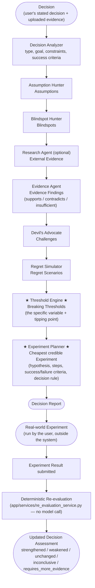

# REGRET ENGINE — Agent Reasoning Pipeline

This is the reasoning/analysis workflow — kept deliberately separate from [`docs/architecture.md`](architecture.md), which covers infrastructure. This diagram shows what transforms as a decision moves through the pipeline, not which AWS service does what.

## Diagram



(Mermaid source: [`agent-workflow.mmd`](agent-workflow.mmd).)

The **Threshold Engine** and **Experiment Planner** stages are highlighted because they're the product's central differentiator: everything before them builds the evidence base; these two stages convert that evidence base into one falsifiable claim (the threshold) and one concrete way to test it (the experiment) — the two artifacts a generic AI opinion never produces.

## The conceptual transformation

```
Decision
   → Assumptions              (what must be true?)
   → Blindspots                (what question is nobody asking?)
   → Evidence                   (what does what I actually have say?)
   → Challenges                  (what's the strongest argument against this?)
   → Regret Scenarios              (specifically, how does this go wrong?)
   → Breaking Thresholds            ← the falsifiable claim
   → Experiment                      ← the cheapest way to test it
   → (real-world result, fed back in)
   → Re-evaluation                    ← deterministic, not another guess
```

## Why this order, specifically

Each stage only ever consumes the *already-persisted, id-bearing* structured output of the stages before it (see `backend/app/agents/orchestrator.py`) — never the user's raw text again, and never another agent's unstructured prose:

1. **Decision Analyzer** must run first — every later stage depends on its structured `decision_type`/`goal`/`constraints`, not the raw text.
2. **Assumption Hunter** and **Blindspot Hunter** run next, in that order, because a blindspot is deliberately framed as "an important question, distinct from an assumption already stated" — the Blindspot Hunter is given the Assumption Hunter's output specifically so it doesn't just restate the same assumptions as questions.
3. **Research Agent** (optional) runs before the Evidence Agent so that, if enabled, any external findings exist in time to matter — but its failure never blocks the pipeline, since it's explicitly optional.
4. **Evidence Agent** runs after assumptions/blindspots exist, because its whole job is mapping evidence *onto* those specific claims — it has nothing to map evidence onto otherwise.
5. **Devil's Advocate** consumes assumptions, blindspots, *and* evidence findings, so its counter-arguments are evidence-grounded, not generic skepticism.
6. **Regret Simulator** runs after the adversarial pass so failure scenarios can incorporate a real challenge, not just an assumption.
7. **Threshold Engine** needs the full picture (assumptions, blindspots, evidence, challenges, regret scenarios) to identify the *specific* variable and tipping point that actually matters — this is deliberately one of the last stages, not an early guess.
8. **Experiment Planner** runs last of the analysis stages because every experiment it recommends must target a real, already-persisted threshold id — it has nothing to design an experiment around before the Threshold Engine exists.

## No chain-of-thought is ever exposed

Every agent's system prompt explicitly forbids exposing internal reasoning, and every agent is configured with a `structured_output_model` (a Pydantic schema in `backend/app/agents/schemas.py`) — the Strands SDK validates the model's response against that schema before the orchestrator ever sees it, and the orchestrator re-validates it a second time before persisting. What moves between agents, and what's ever shown to the user, is the final structured result only.

See [`docs/architecture.md`](architecture.md) for how this pipeline fits into the deployed AWS infrastructure.
