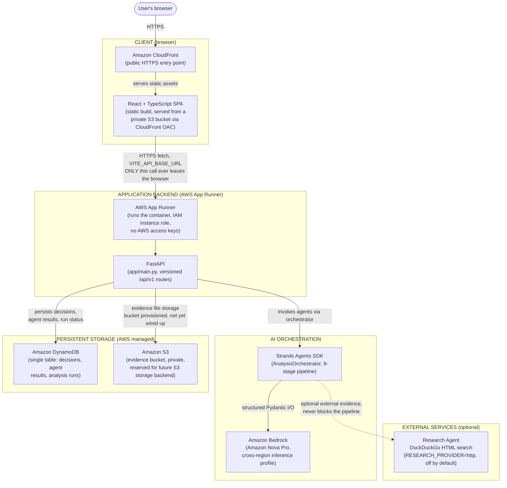

# REGRET ENGINE — System Architecture

This is the actual, deployed infrastructure architecture — not an aspirational diagram. Every component below is real, running, and documented in detail in [`backend/README.md`](../backend/README.md).

## Diagram

(Mermaid source: [`architecture.mmd`](architecture.mmd).)

## Reading the diagram in 20 seconds

1. **Client**: CloudFront serves the React SPA. The browser talks to nothing else in AWS — ever.
2. **Application backend**: App Runner hosts FastAPI in a container. This is the *only* thing with an AWS identity (an IAM instance role, no access keys).
3. **AI orchestration**: FastAPI calls the Strands Agents SDK, which runs 9 sequential agents on Amazon Bedrock.
4. **Persistent storage**: DynamoDB holds every decision and every agent's structured output. An S3 bucket exists for evidence, provisioned and IAM-permissioned, but not yet the active storage backend (see [Limitations](../README.md#26-limitations)).
5. **External services**: an optional Research Agent can search the open web (DuckDuckGo) for additional context — off by default, and never merged into user-uploaded evidence.

## Boundary notes

- **Browser/client boundary**: the React app is static, unauthenticated content served by CloudFront from a *private* S3 bucket (Origin Access Control — direct S3 access returns `403`). The only network call the browser ever makes outside of loading its own static assets is `fetch()` to the FastAPI backend's public HTTPS URL.
- **AWS managed services**: CloudFront, App Runner, DynamoDB, S3, Bedrock, and ECR (not pictured — it's the private container registry App Runner pulls its image from) are all AWS-managed; nothing here is self-hosted infrastructure.
- **Application backend**: a single FastAPI process, containerized, with no in-process state beyond a process-wide concurrency guard for analysis runs. All real state lives in DynamoDB.
- **AI orchestration**: the Strands Agents SDK and Amazon Bedrock are only ever invoked by `AnalysisOrchestrator` (`backend/app/agents/orchestrator.py`) — never directly from an HTTP route handler.
- **Persistent storage**: DynamoDB is single-table (see the key schema in `backend/README.md`); S3 is used today only for the frontend's static build via CloudFront (a *separate* bucket from the evidence bucket).
- **External services**: the only third-party network call in the whole system is the optional Research Agent's outbound HTTPS request to a public search endpoint — no API key required, strictly bounded (max queries/results/timeout), and disabled by default.

## Security-relevant facts this diagram encodes

- The browser never calls DynamoDB, S3, or Bedrock directly.
- No AWS access keys exist in the React build, the Docker image, or App Runner's environment variables — App Runner's instance role is the only credential path, resolved automatically by boto3/Strands.
- Both S3 buckets (frontend, evidence) have Block Public Access fully enabled.
- The App Runner instance role is scoped to exactly the DynamoDB table + indexes, the evidence bucket, and the specific Bedrock inference profile/model — never a wildcard.

See [`docs/agent-workflow.md`](agent-workflow.md) for the reasoning pipeline itself, kept as a separate diagram from this infrastructure view.
